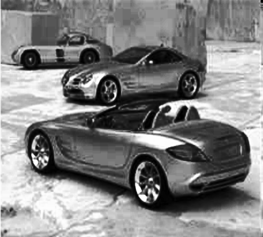

# Histogram Equalization Project

This project demonstrates histogram equalization using Python and OpenCV.

## 🖼️ Output

## ⚙️ Technologies
- Python
- OpenCV
- NumPy
- Matplotlib

## 🎯 Purpose
Histogram equalization enhances image contrast by spreading intensity values, making details more visible.
